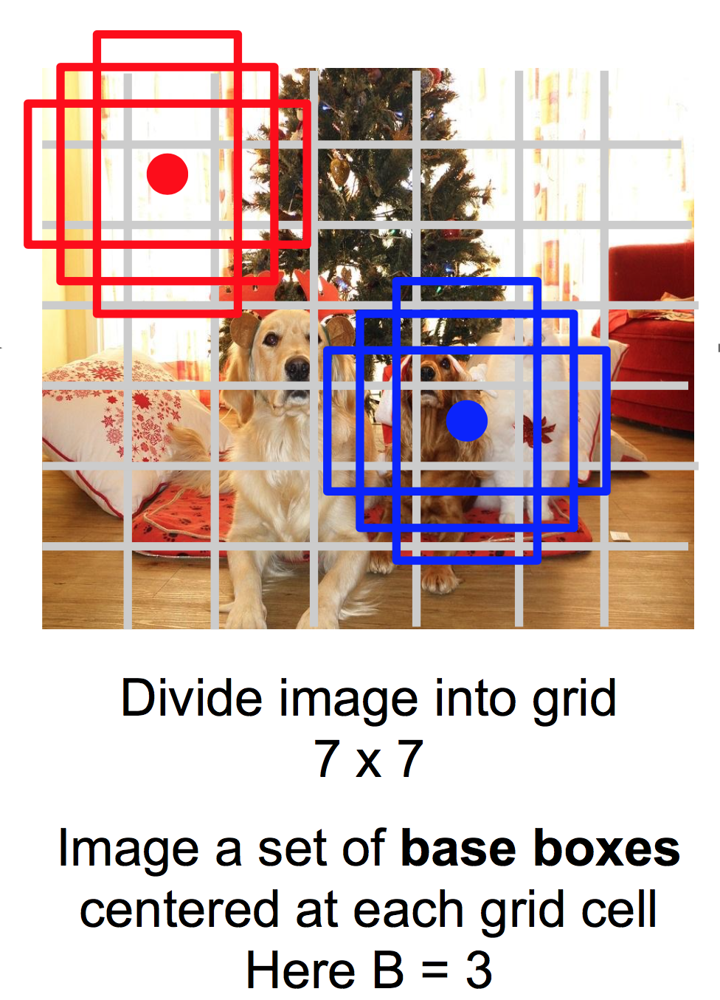

#Vehicle Detection Project

The goals / steps of this project are the following:

* Create a vehicle detection algorithm to detect vehicles in images
* Compute a bounding box for each detected vehicle and draw on image
* Run pipeline on a video stream and follow detected vehicles

## Summary of Approach

I followed the full lecture set for vehicle detection and did all the quizzes and had reasonable initial results with vehicle detection using HOG and sliding window.

At the same time, because I am familiar with recent work in deep learning for object detection, I decided to explore how well a neural network approach would work for the vehicle detection project.

I researched different algorithms for deep learning based object detection and went through the recently released Udacity Self-Driving Car Object Detection Lab.

After experimentation, I got good results with the Single Shot Multibox Detector (SSD) algorithm, using Chainer as the deep learning framework.  I will describe this in more detail in the following sections.

##Vehicle Detection

###1. Object Detection with Deep Learning

The major advances in deep learning in recent years started with *classification*.  In classification, objects in images are classified as e.g. 'dog', 'cat', 'stop sign' etc., as we explored in the traffic sign classification project.

*Object detection* is the problem of figuring out where there are objects in a image: such as finding vehicles in an image as we do in this project.  There are related areas such as *semantic segmentation* (drawing boundaries of potentially different parts of an image, instead of bounding boxes) and *dense captioning* where object detection is combined with captioning (labeling objects in the image).

The following picture gives a rough idea of sone of these image-based problems (image taken from [Stanford cs231n course](http://cs231n.stanford.edu)).

#### Object Detection Algorithms

Object detection with deep learning is a very active area of research with new advances being made every year. Most of the approaches use some type of window (bounding box) where regions of the image are checked for objects.

Some of the prominent algorithms are:

1. R-CNN
2. Fast R-CNN
3. Faster R-CNN
4. Mask R-CNN
5. Yolo
6. SSD (Single Shot Multibox Detection)

All the "R-CNN" variants are based on *region proposals* - in which a convolutional neural network tries to find windows where an object may be present, and then run classification within the regions to make sure there is really an object there.  The classification step may actually involve a non neural-network algorithm such as SVM.  The "RCNN" variants above are listed chronologically so the lower ones are better and more accurate, and usually faster.

YOLO and SSD take a different approache, where instead of searching for windows with region proposals, there are a large number of fixed sets of detection windows (thousands).  YOLO and SSD in practice work very fast, but often less accurately than the RCNN methods.

According to the forums, many students in CarND have tried these approaches, especially YOLO or SSD.

#### Object Detection Lab

Udacity recently published an [Object Detection Lab](https://github.com/udacity/CarND-Object-Detection-Lab) illustrating the deep learning based approach to object detection.

The lab featured the following:

1. Tensorflow framework
2. Using pre-trained models from Tensorflow model zoo
3. Testing with multiple approches from above

With the deep learning approaches to object detection, there is often the use of a standard classification convnet as part of the architecture.  The lab uses combinations of different object detection methods with different convnet base models.

I found that the algorithms and models in the object detection lab have room for improvement.  As I will show below, either the object detection is not very accurate, or the detection is slow.  I found much better results using a similar approach but with different framework and models.

#### Chainer / ChainerCV

[Chainer](http://chainer.org) is a deep learning framework developed in Japan by Preferred Networks.  It is not as widely used as frameworks like Tensorflow, but it is known for good performance, and for the ability to handle dynamic networks such as those used in natural language processing.

The Chainer team recently made public [*ChainerCV*](https://github.com/chainer/chainercv) which is a collection of computer vision models including those for object detection.

While I had never used Chainer before, it had implementations of SSD and Faster RCNN so decided to try it out.  As it turns out, these have both high performance and high accuracy for the vehicle detection task so this is what my project uses.

#### SSD 

In the end, I chose the SSD model for object detection.  SSD works by:

1. Dividing an image in a grid
2. Placing a number of different bounding boxes centered on each grid
3. Detecting objects in each box

Some resources on SSD are:

* [Arxiv paper](https://arxiv.org/abs/1512.02325)
* [Github](https://github.com/weiliu89/caffe/tree/ssd)
* [Stanford cs231n lecture on object detection - slides 83/84 for SSD](http://cs231n.stanford.edu/slides/2017/cs231n_2017_lecture11.pdf)

An illustration of SSD approach from Stanford cs231n class is below.

Below is the architecture of the SSD network.

###2. Explain how (and identify where in your code) you extracted vehicles from the training images.

In my implementation, I directly use ChainerCV's pretrained models for the vehicle detection task.

I tested the following models:

1. SSD 300x300 pixel model
2. SSD 512x512 pixel model (usually more accurate due to higher resolution, but higher runtime cost)
3. Faster RCNN model (usually more accurate than SSD and Yolo)

The code for SSD 300x300 is in cells `2` and `3` of the [Jupyter notebook](Vehicle%20Detection.ipynb).

The code is very simple.  To load the model, use a predefined Python method:

	model = SSD300(
	   # Load object label names
       n_fg_class=len(voc_bbox_label_names),
       # Load pretrained data from Pascal VOC 2007 and 2012 datasets
       pretrained_model='voc0712')
    
Once the model is loaded, running the vehicle extraction is one line of code:

	# Run object detection
	bboxes, labels, scores = model.predict([image])

Above is all that is needed for the object detection.  In addition to the above,
there is a line using Chainer's routine for reading images, a line for displaying
the output (example shown below),
and a couple of extra lines to optinally use GPU.

#### Example output

Test image:

SSD output using ChainerCV's standard visualization routine - includes bounding box, object label, and object detection score:

###3. Explain how you settled on your final choice of vehicle detection algorithm.

In total, I tested 7 different combinations of frameworks and models for the full object detection vide pipeline.

Below are the different experiments, showing the average processing time for single image detection (same test image at least 20 times for each experiment).

The Model column is a combination of the object detection algorithm and the base convolutional neural network model.  The Dataset column lists the dataset used for the pretrained model.  'MS Coco' and 'Pascal VOC' are two of the most common datasets for object detection benchmarks.  I did not include code for all the timings but I can upload them to github as needed.

| Model        | Dataset | Framework   |  Time  |
|:-------------:|:-------------:|:-----:|:-------:|
| SSD + Mobilenet  | MS Coco | Tensorflow | 61.7ms  |
| SSD + Inception  | MS Coco | Tensorflow | 72.0ms  |
| RFCN    | MS Coco | Tensorflow | 208ms  |
| Faster RCNN | MS Coco   | Tensorflow | 936ms  |
| SSD 300x300 | Pascal VOC 2007/2012 | Chainer |  22.4ms |
| SSD 512x512 | Pascal VOC 2007/2012 | Chainer |  37.1ms |
| Faster RCNN | Pascal VOC 2007   | Chainer |  65.3ms  |

As can be seen, the Chainer models are substantially faster.  The Chainer SSD models are quite fast - over 40 frames per second using GPU, and do a very good job detecting the cars as demonstrated in video below.

Within the Tensorflow models, the SSD models are not very accurate.  They completely miss the car for very significant periods of time.  

The Tensorflow Faster RCNN model has the highest accuracy of all the tested models here but is extremely slow, taking almost a full second per frame.  The accuracy is such that it picks out small cars in the opposite lane, and is the only one that detects the smaller car far ahead.  I have link to the video in the video section.

Interestingly, the Chainer Faster RCNN model is more 'jumpy' than both the Chainer SSD models and the Tensorflow Faster RCNN model.

In the end I chose the Chainer SSD models, and in the Jupyter notebook, I show results for both the 300x300 and 512x512 models.

###4. Show some examples of test images to demonstrate how your pipeline is working. How did you optimize the performance of your classifier?

Below is the result of running the pipeline on the test image from above.  The pipeline code is in cell `6` of the notebook.

I optimized the performance of my pipeline by choosing between the different neural network models as described in the previous section.

## Video Implementation

###1. Provide a link to your final video output.  Your pipeline should perform reasonably well on the entire project video (somewhat wobbly or unstable bounding boxes are ok as long as you are identifying the vehicles most of the time with minimal false positives.)

Here are links to the video output for the Chainer SSD models.

* [Chainer SSD 300x300](chainer_ssd_300.mp4)
* [Chainer SSD 512x512](chainer_ssd_512.mp4)

For reference, here is the video output for some of the other models.  The Tensorflow SSD models completely miss the car in many frames, and the Tensorflow Faster RCNN model is very good but at 900ms per frame, too slow for practical use today.

* [Tensorflow SSD Mobilenet](tensorflow_ssd_mobilenet.mp4)
* [Tensorflow SSD Inception](tensorflow_ssd_inception.mp4)
* [Tensorflow Faster RCNN](tensorflow_faster_rcnn.mp4)

###2. Describe how (and identify where in your code) you implemented some kind of filter for false positives and some method for combining overlapping bounding boxes.

The Chainer SSD models do detect false positives.  They tend to sometimes detect large parts of the left side of the lane as an object as shown below.

The `filter_outliers` method in cell `6` rejects these outliers by removing bounding boxes above a certain width.  The same image as above is shown below with outlier removal.

---

## Discussion

####1. Briefly discuss any problems / issues you faced in your implementation of this project.  Where will your pipeline likely fail?  What could you do to make it more robust?

Overall, I found the deep learning approach to object detection to work very well.  The state of the art in neural network models, frameworks, and pretrained models is such that it is possible to put together an object detection project quickly.  This includes experimenting with multiple models and algorithms to find the best one.

Here are some areas where my final implementation can be improved.

1. The model does lag a bit in detecting cars when they first 'enter' from the right side of the frame.  This can probably be improved by training on occluded samples with data augmentation.
2. The model does not detect the cars farther ahead of the vehicle, that appear smaller.  For a real self-driving car, detecting these cars is important as part of environmental awareness.  The Tensorflow Faster RCNN model does pick them up.  One way to address this is to implement a more car-centric version of SSD that has adaptive window sizes farther away from the vehicle.

